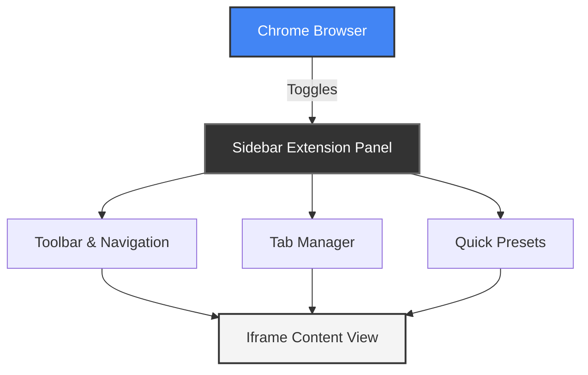

# Browser Sidebar Chrome Extension

A sleek and functional Chrome extension that acts as a mini-browser right inside your browser's side panel. It allows you to multi-task efficiently by keeping important web apps or searches accessible in a dedicated sidebar without cluttering your main tabs.

## Features

- **Mini Browser Tabs**: Open and manage multiple tabs within the sidebar.
- **URL & Search Bar**: Easily navigate to any URL or search the web directly from the side panel.
- **Quick Preset Shortcuts**: Instant access to frequently used applications like Google, Google Docs, Google Sheets, ChatGPT, and Claude.
- **Modern UI**: Clean dark mode aesthetics with smooth interactions.

## Architecture Diagram



## Clone the Repository

To get started, clone this repository to your local machine:

```bash
git clone https://github.com/Raj-pro/browser-sider-bar-chrome-extension.git
```

## How to Load in Chrome (Developer Mode)

To install and test this extension locally on your machine, follow these steps:

1. **Open Extension Settings:** 
   Open Google Chrome and navigate to `chrome://extensions/` in your address bar.
2. **Enable Developer Mode:** 
   In the top right corner of the Extensions page, toggle on **Developer mode**.
3. **Load Unpacked:** 
   Click the **Load unpacked** button that appears in the top left corner.
4. **Select Directory:** 
   Browse to the directory where you cloned or saved this project and select it.
5. **Open the Sidebar:**
   - Click the Extensions puzzle piece icon in Chrome's top right toolbar.
   - Find the extension and pin it for easy access.
   - Click the extension icon or use Chrome's side panel dropdown to open it.
